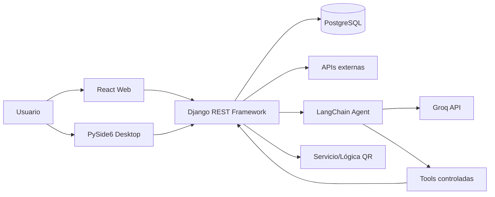

# Arquitectura propuesta

```mermaid
flowchart LR
    U[Usuario] --> W[React Web]
    U --> D[PySide6 Desktop]
    W --> API[Django REST Framework]
    D --> API
    API --> DB[(PostgreSQL)]
    API --> EXT[APIs externas]
    API --> AG[LangChain Agent]
    AG --> GROQ[Groq API]
    AG --> TOOLS[Tools controladas]
    TOOLS --> API
    API --> QR[Servicio/Lógica QR]
```

**Regla central:** los clientes no acceden directamente a PostgreSQL; toda operación pasa por la API REST.
